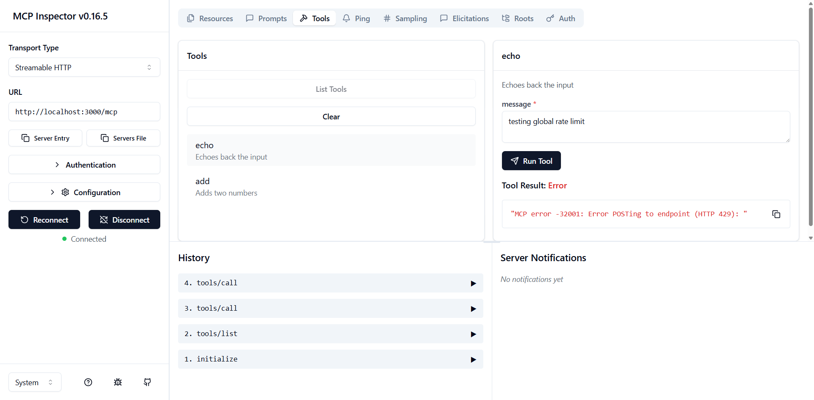

## Global Rate Limiting Example

This example shows how to use the agentgateway to perform global rate limiting with Envoy's ratelimit server and Redis backend.

It is recommended to complete the [basic](../basic), [authorization](../authorization) and [local rate limiting](../local) examples before this one.

### Running the example

First, start the Redis and ratelimit server:

```bash
docker run -d --name redis --network host redis:7.4.3
docker run -d --name ratelimit \
  --network host \
  -e REDIS_URL=127.0.0.1:6379 \
  -e USE_STATSD=false \
  -e LOG_LEVEL=debug \
  -e REDIS_SOCKET_TYPE=tcp \
  -e RUNTIME_ROOT=/data \
  -e RUNTIME_SUBDIRECTORY=ratelimit \
  -v $(pwd)/examples/ratelimiting/global/ratelimit-config.yaml:/data/ratelimit/config/config.yaml:ro \
  envoyproxy/ratelimit:3e085e5b \
  /bin/ratelimit -config /data/ratelimit/config/config.yaml
```

Then start the agentgateway:

```bash
cargo run -- -f examples/ratelimiting/global/config.yaml
```

In addition to the basic configuration from the [basic](../basic), [authorization](../authorization) and [local rate limiting](../local) examples, we have a few new fields:

The `remoteRateLimit` indicates how to configure global rate limiting with an external ratelimit server.

```yaml
policies:
  remoteRateLimit:
    domain: "agentgateway"
    host: "127.0.0.1:8081"
    descriptors:
      - entries:
          - key: "user"
            value: '"test-user"'
          - key: "tool"
            value: '"echo"'
        type: "requests"
```

The `jwtAuth` configuration uses the example JWT keys and tokens included for demonstration purposes only.

```yaml
policies:
  jwtAuth:
    issuer: agentgateway.dev
    audiences: [test.agentgateway.dev]
    jwks:
      file: ./manifests/jwt/pub-key
```

With this configuration, users will be required to pass a valid JWT token matching the criteria.
An example token signed by the key above can be found at `manifests/jwt/example1.key`; this can be
passed into the MCP inspector `Authentication > Bearer Token` field.

The rate limiting configuration defines:
- **Combined limit**: 5 requests/minute for `(user=test-user,tool=echo)`
- **Tool limit**: 20 requests/minute for `tool=echo`

To test the rate limiting, use the MCP inspector with the JWT token and send multiple requests. 
Now that we have the gateway running, we can use the [mcpinspector](https://github.com/modelcontextprotocol/inspector) to try it out.
```bash
npx @modelcontextprotocol/inspector
```



The system will return `OVER_LIMIT` responses when thresholds are exceeded.

To monitor rate limiting behavior:
```bash
docker logs -f ratelimit | grep -E '(OVER_LIMIT|OK)'
```

Refer to the [telemetry](../telemetry) example to learn how to visualize metrics and tracing provided by agentgateway for your MCP servers.