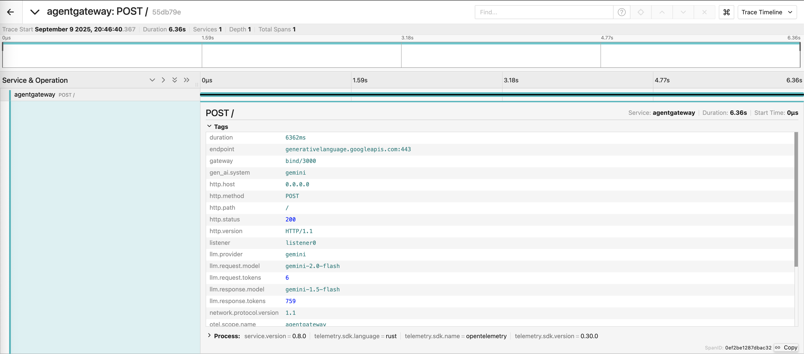

## Telemetry Tracing Example

This example shows how to use the agentgateway to visualize traces for LLM backends calls.
This builds upon the [RBAC sample](../authorization).
While you can use tracing without RBAC, this example uses both together to showcase augmenting traces with information from the authenicated user.

### Running the example

```zsh
cargo run -- -f examples/telemetry/config.yaml
```

### Send a request to LLM provider.

```zsh
curl "http://0.0.0.0:3000/" \
-H "Content-Type: application/json" \
-H "Authorization: Bearer GEMINI_API_KEY" \
-d '{
    "model": "gemini-2.0-flash",
    "messages": [
        {"role": "user", "content": "Explain to me how AI works"}
    ]
    }'
```

### Setup Jaeger
```zsh
docker compose -f - up -d <<EOF
services:
  jaeger:
    container_name: jaeger
    restart: unless-stopped
    image: jaegertracing/all-in-one:latest
    ports:
    - "127.0.0.1:16686:16686"
    - "127.0.0.1:14268:14268"
    - "127.0.0.1:4317:4317"
    environment:
    - COLLECTOR_OTLP_ENABLED=true
EOF
```

Now we can open the [Jaeger UI](http://localhost:16686/search) and search for our spans:



